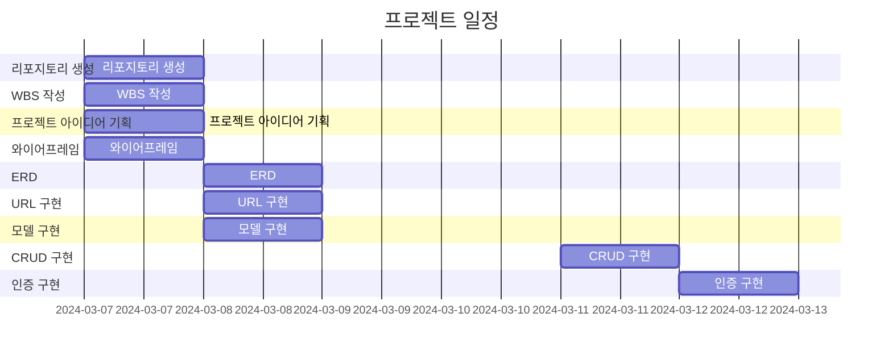
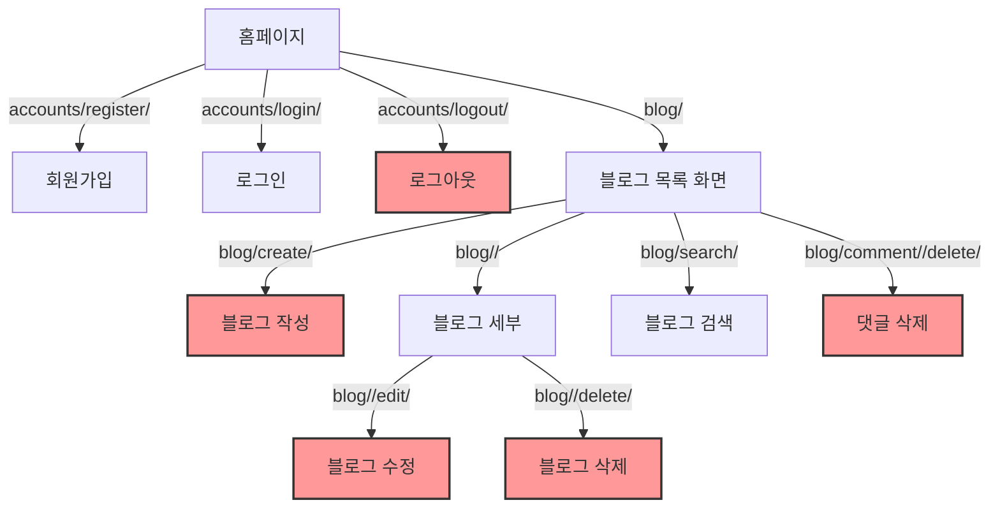
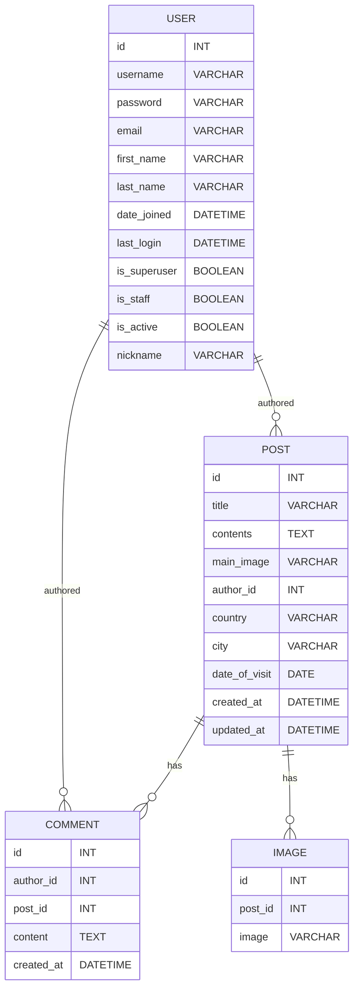
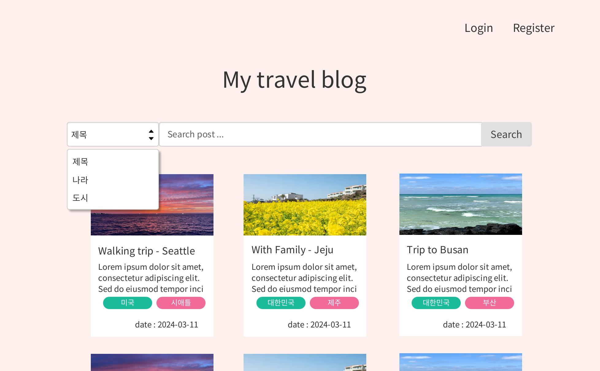
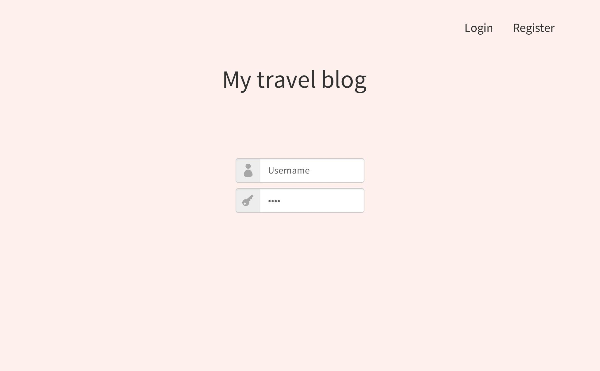

# travel_blog
## 소개
  이 여행 블로그는 개인적인 여행 기록과 사진을 저장하기 위한 웹사이트입니다. 이 프로젝트는 Django 웹 프레임워크를 사용하여 구축되었습니다.

## 기능
- 게시글 작성 및 관리: 여행한 나라, 도시, 내용, 날짜, 사진, 댓글을 포함한 게시글을 작성하고 관리할 수 있습니다.
- 댓글 기능: 다른 사용자의 게시글에 댓글을 달아 소통할 수 있습니다.
- 사용자 인증: 사용자 등록, 로그인, 로그아웃 기능을 통해 개인화된 경험을 제공합니다.

## 서비스 URL 정보
- blog github repo: https://github.com/sunha-shin/travel_blog
    
## WBS

## URL 구조

## DB 테이블 구조도

## 화면 정의서
| 메인화면|특징|
|---------------------------------|--------------------------------------------------|
| |검색, 블로그 리스트, 로그인/회원가입 기능이 한페이지에 보임|

| 나라검색|도시검색|
|---------------------------------|--------------------------------------------------|
| | |

| 로그인|로그인 후|
|---------------------------------|--------------------------------------------------|
| | |

| 로그인 후 글쓰기|블로그 디테일|
|---------------------------------|--------------------------------------------------|
| | |

| 블로그 디테일|로그아웃 후 메인화면|
|---------------------------------|--------------------------------------------------|
| | |

| 로그아웃 후 댓글창|로그아웃 후 댓글창|
|---------------------------------|--------------------------------------------------
| ||

## 트러블슈팅 히스토리